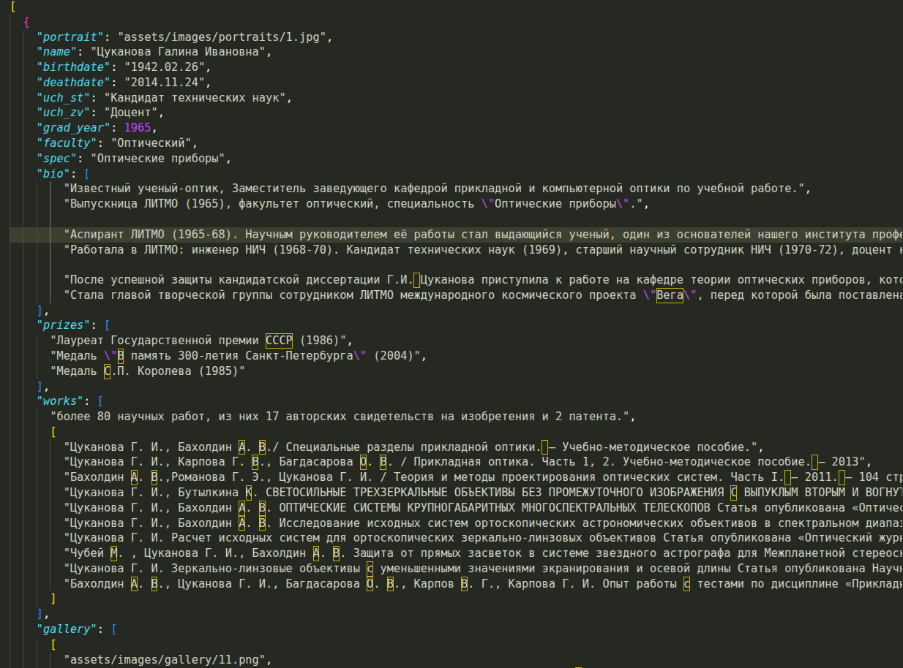

На данный момент сайт не размещен на каком-либо сервере, но видео демо сайта можно увидеть в файле "demo.mp4". (сайт также можно запустить локально с помощью VSCode и плагина LivePreview.)

Вся информация об ученых структурирована в JSON файл "/source/people.json"

С помощью javascript нужные данные из JSON файла автоматически вставляются в веб-страницы